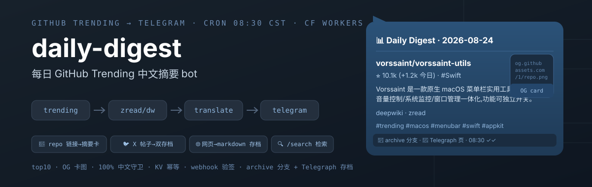
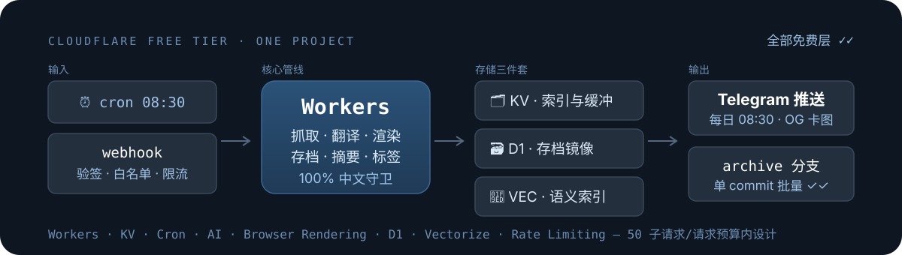

> 🤖 **AI 部署清单（AI Deployment Manifest）** — 供 AI Agent（Cursor / Devin / Copilot / Hermes）读取: 部署前先读 **[`AGENTS.md`](AGENTS.md)**（机器可读部署指令）。人类请看 **[`docs/DEPLOYMENT.md`](docs/DEPLOYMENT.md)**。

<h1 align="center">daily-digest</h1>

<p align="center">
  <a href="README.md">English</a> · <a href="README.zh-CN.md">简体中文</a>
</p>

<p align="center">
  <a href="#-命令与消息"></a>
  <a href="#-描述获取链"></a>
  <a href="https://github.com/gandli/daily-digest/actions/workflows/deploy.yml"></a>
</p>

<p align="center">
  
</p>

GitHub Trending / HN / Product Hunt → **Telegram 中文摘要 bot**。任意链接(X 帖/网页/repo)三级存档 + 全库检索,Cloudflare Workers 免费层单项目。

每天 **08:30(北京时间)** 自动推送 top10 仓库——每仓一条消息:OG 卡图 + 星数/语言/**中文描述**/deepwiki·zread 链接/topics 标签;数据批量 commit 到本仓 [archive 分支](https://github.com/gandli/daily-digest/tree/archive)(每日 cron 首位 flush 或缓冲满 20 条时合并为**一个 commit**,见[存档批量化](#-存档三链))。

📖 **[用户手册](docs/guide/README.md)** — 10 个核心事务的逐步操作说明(带标注聊天截图),由 e2e 场景驱动自动生成,随 CI 与 Bot 功能保持同步(管线见 [scripts/manual/](scripts/manual/) + `.github/workflows/manual.yml`)。

## 📱 命令与消息

| 输入 | 行为 |
|---|---|
| `/gt` | 当日榜单(cron 已抓取,读 `digest:<date>` 缓存秒回;当天 trending 固定不重抓) |
| `/hn` | 今日 HN 酷产品:读 archive 分支 `product/<date>.json` 秒回产品卡;未生成时自动触发 GitHub Actions,完成后推送 |
| `/ph` | **Product Hunt 每日热门**:官方 feed 免 key 直拉 top10,中文摘要 + 产品卡(ogUrl 预览),当日缓存秒回;榜单存档 `ph-<日期>.md` |
| `/search <关键词>` | **混合检索**:子串 AND 匹配 + Vectorize 语义补页(✨ 标记),覆盖星标/书签/存档 6000+ 条;结果当页英文描述批量译中,分页 + inline keyboard 翻页/跳转 |
| `/archive [页码]` | 历史存档分页列表,每条约**存档三链**(Telegraph → 互联网档案馆 web.archive.org → GitHub md) |
| `/start` `/help` 其他 | 使用提示 + 命令菜单注册 |
| 含 GitHub 仓库链接 | 单仓 → 查询卡(无序号);**多个 repo 链接 → 逐仓精简卡全并发(N/M 序号, 原文描述不翻译)**,全部已存档回一句话;当日已查回存档三链卡 |
| 含 X/Twitter 链接 | FxEmbed 取帖 → **中文摘要 + 三级存档**(Telegraph/互联网档案馆/GitHub md);article 长文帖直接用内嵌标题;帖内多 repo 自动逐仓精简卡(`N/M` 序号, 原文描述) |
| 含其他网页链接 | markdown 三级链 → **中文摘要(summarizeZh)** → 三级存档;重发 done 回存档链接而非"已处理过" |

卡片序号 `N/M` 仅在多条批量时出现(trending/product 推送、多 repo 联动);单条卡不带序号。

## 🔗 描述获取链

```text
deepwiki 概述(剥模板开场白)
  → zread wiki 中文
    → 翻译回退链(Workers AI m2m100 → TranSmart → Google → MyMemory)
      → GitHub repo 描述(中文直用 / 英文翻译)
```

**100% 中文守卫**:非中文结果一律不渲染。

## 📦 存档三链

所有链接(网页 / X 帖 / repo)归档后回**三级存档链接**,按优先级展示:
1. **Telegraph** — 长文备份页(每日 digest 与 X 帖各自建页,即时生效)
2. **互联网档案馆** `web.archive.org` — 兜底快照(`web/2/<url>` 自动定位最近版本,即时生效)
3. **GitHub md** — archive 分支 markdown 原文(**批量化**:先入 KV 缓冲,每日 cron 或缓冲满 20 条时经 Git Data API 合并 push 为一个 commit,因此该链接最长延迟到下次 flush 才生效)

## 🏗️ 架构

<p align="center">
  
</p>

- `src/sources/` 数据源注册表(数组即注册表;新增源=新文件+一行)
- `src/zread.ts` / `src/deepwiki.ts` RSC payload 概述提取
- `src/translate.ts` 四级翻译回退 + isChinese 守卫 + CF Summarization 摘要
- `src/render.ts` Telegram HTML / GitHub markdown / Telegraph nodes 三种渲染
- `src/archive.ts` 存档批量化:KV pending 缓冲(`pend:arc:*`) → Git Data API 合并 push 为一个 commit(每日 cron + 缓冲 ≥20 触发;KV 故障回落 Contents API 直推) + Telegraph createPage + 分块 base64 编码
- `src/lookup.ts` 仓库查询管线(URL 存档/OG 四级图链/repo 联动去重/多 repo 精简卡全并发)
- `src/d1.ts` D1 存档镜像:元数据 upsert + flush 后 markdown 冗余;/archive 查询 D1 优先、KV 兜底(每次调用恒 1 子请求)
- `src/vec.ts` Vectorize 语义索引镜像(bge-m3 1024 维):/search 混合检索的补页来源,子串命中不足一页才查询省子请求
- `src/urlmd.ts` 任意 URL→markdown 三级免费链(Markdown for Agents → AI.toMarkdown → Browser Rendering)
- `src/fxtweet.ts` X/Twitter 帖子存档(FxEmbed 公共 API,article 长文直用内嵌标题)
- `scripts/manual/` 用户手册自动化管线:e2e 场景驱动真实 worker → 合成聊天截图(带标注) → AI 生成逐步说明 → `.github/workflows/manual.yml` 随代码变更重生成 [docs/guide/](docs/guide/)
- KV 缓存当日 cron 结果;webhook 验签 timingSafeEqual + chat 白名单 + Rate Limiting(20 次/分);/search 用 KV 单键压缩索引 + 语义混合检索

详见 [`docs/GOAL.md`](docs/GOAL.md)(验收标准 A1–A14)。接口/命令/KV 键详表见 [`docs/INTERFACES.md`](docs/INTERFACES.md)， 开发进度见 [`docs/ROADMAP.md`](docs/ROADMAP.md)， 架构/数据流/时序图见 [`docs/diagrams/*.mmd`](docs/diagrams/)。

## 💻 开发

```bash
npm install
npm run dev        # wrangler dev --test-scheduled
curl http://localhost:8787/__scheduled   # 手动触发 cron 管线
npx tsc --noEmit   # 类型检查
npm test           # vitest 836 用例(57 文件)
npm test -- --coverage  # 覆盖率报告
npm run manual     # 用户手册全管线: e2e 场景 → 标注截图 → AI 正文(无 key 自动模板兜底)
```

## 🔑 Secrets 与部署

➡️ **完整部署说明见 [`docs/DEPLOYMENT.md`](docs/DEPLOYMENT.md)**（资源创建、secrets 配置、CI/CD 设置、验证步骤）。

快速开始: `cp .dev.vars.example .dev.vars` → 填入值 → `npx wrangler dev` 本地跑；PR 合并 main → CI 自动部署。

## 🚀 部署

PR 合并 main → GitHub Actions 自动 `wrangler deploy`(需 repo secrets CLOUDFLARE_API_TOKEN / CLOUDFLARE_ACCOUNT_ID)。部署后自动播种 search:index(脚本从 library.jsonl 生成)。

main push 另触发 changelog workflow 自动更新 [CHANGELOG.md](CHANGELOG.md)(conventional-changelog 按 squash PR title 分组)。

## 📚 文档

- [`docs/GOAL.md`](docs/GOAL.md) — 验收契约(A1–A14,FR/AC/Milestones)
- [`docs/INTERFACES.md`](docs/INTERFACES.md) — 命令 / HTTP 端点 / KV 键全表
- [`docs/ROADMAP.md`](docs/ROADMAP.md) — 开发计划与进度
- [`docs/guide/`](docs/guide/README.md) — 用户手册(自动生成)
- [`docs/diagrams/`](docs/diagrams/) — 架构 / 时序 / 数据流图(mmd+png+svg)

## 🗺️ 路线

- 短期:描述缓存 refresh 调优、search 翻译结果缓存回索引、VEC 索引重建(历史条目从未 upsert,语义检索退化)
- 长线:网页收藏源 / X 帖子源 —— 各一个 fetch 函数接入 `src/sources/index.ts` 即可,管线零改动

---

<p align="center">
  <sub>Cloudflare 免费层全家桶:Workers · KV · D1 · Vectorize · AI · 836 tests · CI 自动部署 · changelog 自动生成 · 用户手册自动生成</sub>
</p>
