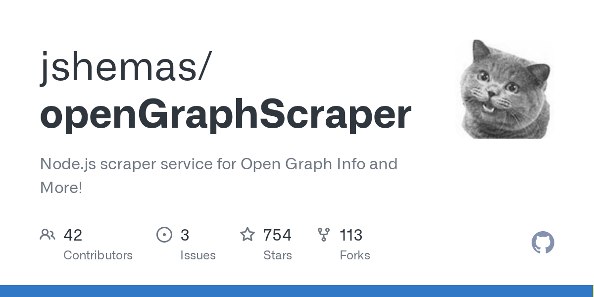

# Daily Digest · 2026-08-25

1. **[jshemas/openGraphScraper](https://github.com/jshemas/openGraphScraper)** ⭐ 754 · TypeScript
   - 解释其目的、功能和基本架构. 有关安装和基本使用说明,请参阅 Getting Started. 有关详细架构和组件级文件,请参阅架构和核心组件。
   - [deepwiki](https://deepwiki.com/jshemas/openGraphScraper) · [zread](https://zread.ai/jshemas/openGraphScraper)

   

---
由 daily-digest bot 自动生成
