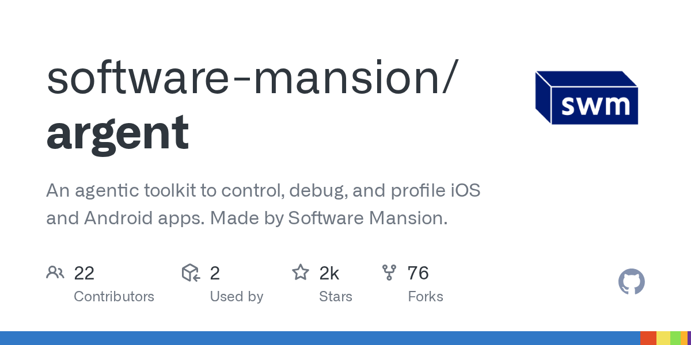

# Daily Digest · 2026-08-25

1. **[software-mansion/argent](https://github.com/software-mansion/argent)** ⭐ 2.2k · TypeScript
   - Argent是一个代理工具包,旨在为人工智能助理提供对iOS模拟器、Android模拟器、物理设备、电视(Apple TV、Android TV、Fire TV)和电子/Chromium桌面或Web应用程序的直接、自主控制。
   - [deepwiki](https://deepwiki.com/software-mansion/argent) · [zread](https://zread.ai/software-mansion/argent)

   

---
由 daily-digest bot 自动生成
