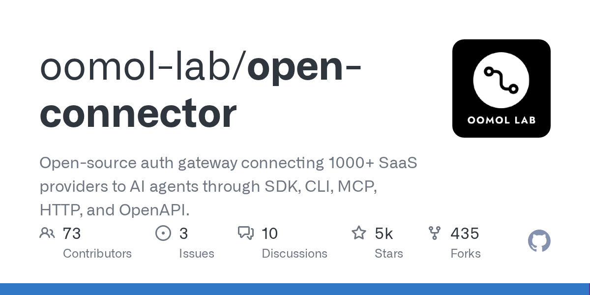

# Daily Digest · 2026-08-25

1. **[oomol-lab/open-connector](https://github.com/oomol-lab/open-connector)** ⭐ 5.2k · TypeScript
   - OpenConnector 是一个开源连接层,旨在为人工智能代理提供可靠、安全和可检验的外部 SaaS 应用程序访问权限,它作为处理身份验证、工具发现和行动执行的中介,同时将敏感身份证件保留在受控的运行时间边界后,同时向代理商暴露标准化接口。
   - [deepwiki](https://deepwiki.com/oomol-lab/open-connector) · [zread](https://zread.ai/oomol-lab/open-connector)

   

---
由 daily-digest bot 自动生成
