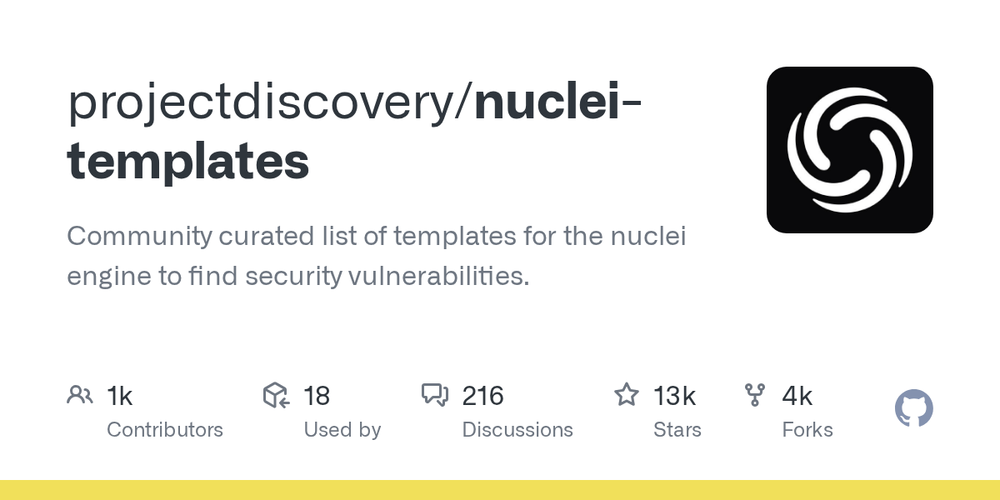

# Daily Digest · 2026-08-25

1. **[projectdiscovery/nuclei-templates](https://github.com/projectdiscovery/nuclei-templates)** ⭐ 12.8k · JavaScript
   - 这些模板为 Nuclei 扫描引擎提供基于 YAML 的安全检测模板,可在 Web 应用程序、云基础设施、网络服务和本地文件中自动检测安全漏洞、错误配置、曝光服务和技术指纹。
   - [deepwiki](https://deepwiki.com/projectdiscovery/nuclei-templates) · [zread](https://zread.ai/projectdiscovery/nuclei-templates)

   

---
由 daily-digest bot 自动生成
