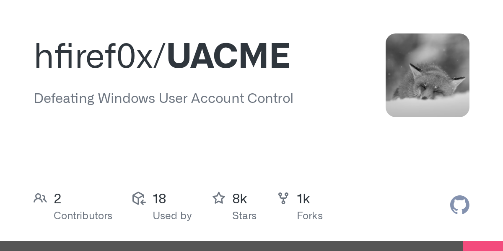

# Daily Digest · 2026-08-25

1. **[hfiref0x/UACME](https://github.com/hfiref0x/UACME)** ⭐ 7.8k · C
   - UACMe是一个全面的工具包,旨在演示和文档绕过Windows用户帐户控制(UAC)的技术,用于安全研究和教育目的,该库包含从Windows 7到Windows 11的80多种不同UAC绕过方法的实现。
   - [deepwiki](https://deepwiki.com/hfiref0x/UACME) · [zread](https://zread.ai/hfiref0x/UACME)

   

---
由 daily-digest bot 自动生成
