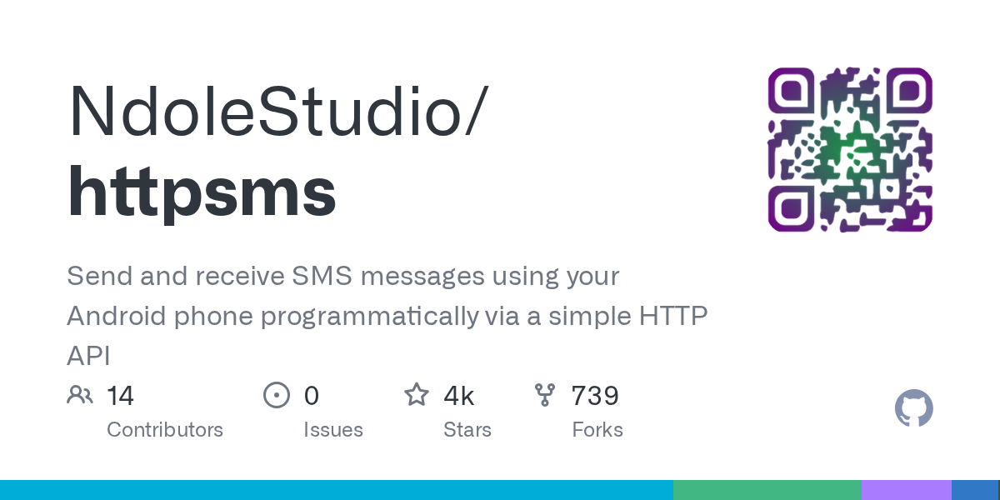

# Daily Digest · 2026-08-25

1. **[NdoleStudio/httpsms](https://github.com/NdoleStudio/httpsms)** ⭐ 4.4k · Go
   - 使用您的 Android 手机通过简单的 HTTP API 编程发送和接收短信
   - [deepwiki](https://deepwiki.com/NdoleStudio/httpsms) · [zread](https://zread.ai/NdoleStudio/httpsms)

   

---
由 daily-digest bot 自动生成
