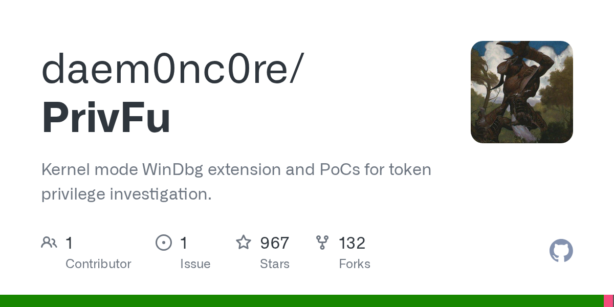

# Daily Digest · 2026-08-25

1. **[daem0nc0re/PrivFu](https://github.com/daem0nc0re/PrivFu)** ⭐ 967 · C#
   - 内核模式 WinDbg 扩展和 PoCs 用于代币特权调查。
   - [deepwiki](https://deepwiki.com/daem0nc0re/PrivFu) · [zread](https://zread.ai/daem0nc0re/PrivFu)

   

---
由 daily-digest bot 自动生成
