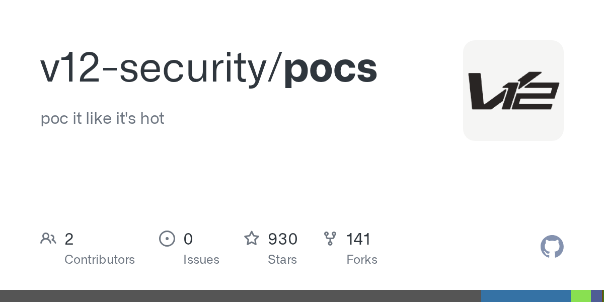

# Daily Digest · 2026-08-25

1. **[v12-security/pocs](https://github.com/v12-security/pocs)** ⭐ 930 · C
   - 该存储库是由 v12-security README.md:1-4 开发的 Proof-of-Concept (PoC) 漏洞发布的官方公共平台。该存储库旨在托管团队发现或研究的漏洞的技术实现,为安全研究人员和系统管理员提供一个集中位置来研究这些漏洞并验证补丁。
   - [deepwiki](https://deepwiki.com/v12-security/pocs) · [zread](https://zread.ai/v12-security/pocs)

   

---
由 daily-digest bot 自动生成
