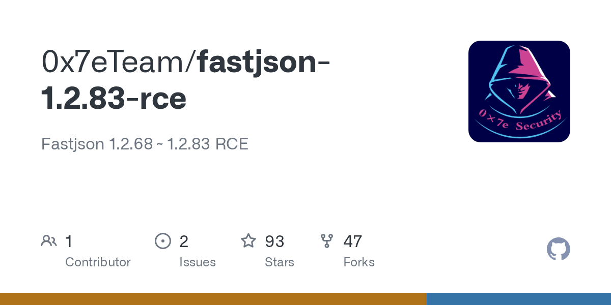

# Daily Digest · 2026-08-25

1. **[0x7eTeam/fastjson-1.2.83-rce](https://github.com/0x7eTeam/fastjson-1.2.83-rce)** ⭐ 93 · Java
   - 该流程分为五个阶段：(1) 攻击者使用  生成一个恶意 JAR，其类名本身就是一个  URL，然后通过简单的 HTTP 服务器将其托管。(2) 漏洞利用脚本  构造一个 JSON 负载，其  值为保留所有点号的类名（因为 Fastjson 内部会用斜杠替换它们）。(3) 目标的  端点将此 JSON 传递给 ，随后进入 。(4)  注解检测路径通过  转换类名，生成有效的  协议 URL，并对其调用 。(5) Spring Boot 的  获取远程 JAR，加载该类，检测到  注解，并调用 ——这会触发静态初始化器并执行嵌入的命令。
   - [deepwiki](https://deepwiki.com/0x7eTeam/fastjson-1.2.83-rce) · [zread](https://zread.ai/0x7eTeam/fastjson-1.2.83-rce)

   

---
由 daily-digest bot 自动生成
