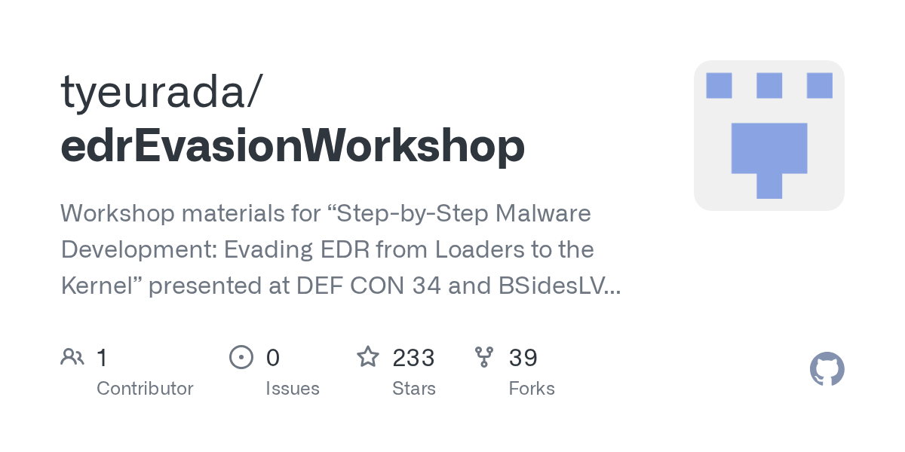

# Daily Digest · 2026-08-25

1. **[tyeurada/edrEvasionWorkshop](https://github.com/tyeurada/edrEvasionWorkshop)** ⭐ 233
   - 在 DEF CON 34 和 BSidesLV 2026 上展示的“一步一步恶意软件开发:从加载器逃离 EDR 到内核”的研讨会材料涵盖了恶意软件开发、EDR 架构、EDR 逃避、C2 定制和内核级别的技术。
   - [deepwiki](https://deepwiki.com/tyeurada/edrEvasionWorkshop) · [zread](https://zread.ai/tyeurada/edrEvasionWorkshop)

   

---
由 daily-digest bot 自动生成
