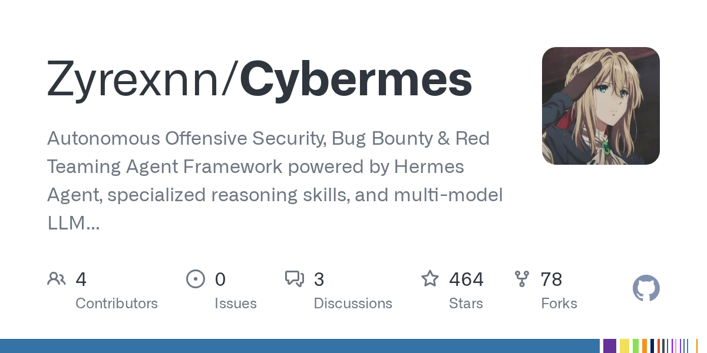

# Daily Digest · 2026-08-25

1. **[Zyrexnn/Cybermes](https://github.com/Zyrexnn/Cybermes)** ⭐ 464 · Python
   - Cybermes 是一个企业级的自主攻击性安全 Agent 框架，专为高信噪比侦察、攻击面发现、认证后漏洞研究、零误报漏洞验证以及自动化执行报告而设计。它将原生 Go 语言的性能内核与 AI 驱动的推理循环相结合，提供了一个既强大又易于在 Linux、macOS 和 Windows 上使用的安全研究平台。
   - [deepwiki](https://deepwiki.com/Zyrexnn/Cybermes) · [zread](https://zread.ai/Zyrexnn/Cybermes)

   

---
由 daily-digest bot 自动生成
