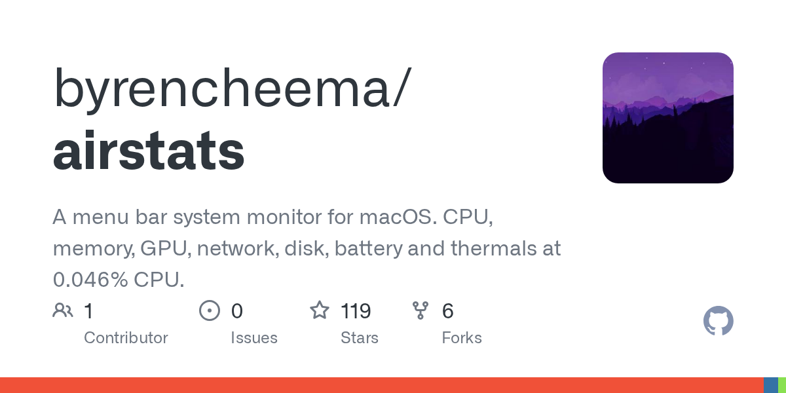

# Daily Digest · 2026-08-26

1. **[byrencheema/airstats](https://github.com/byrencheema/airstats)** ⭐ 119 · Swift
   - AirStats 是专为 macOS 设计的高性能轻量级系统监视器,为 CPU、GPU、内存、网络、磁盘、电池、热和流程统计提供实时远程测量功能,系统通过三种主要接口提供这些指标:菜单栏中的状态项、连接到状态项的详细面板和浮动桌面覆盖 README.md:16-19。
   - [deepwiki](https://deepwiki.com/byrencheema/airstats) · [zread](https://zread.ai/byrencheema/airstats)

   

---
由 daily-digest bot 自动生成
