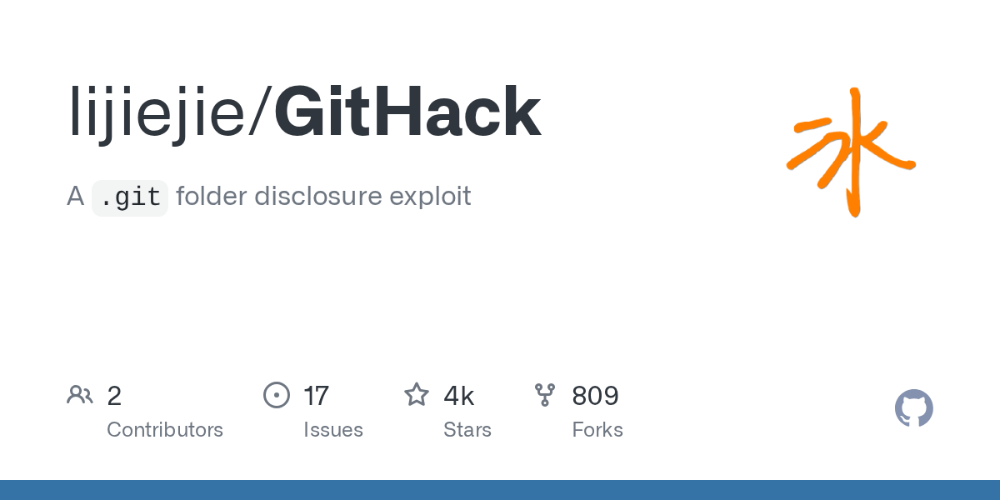

# Daily Digest · 2026-08-26

1. **[lijiejie/GitHack](https://github.com/lijiejie/GitHack)** ⭐ 3.6k · Python
   - GitHack 是一个专门的安全工具,旨在利用错误配置的 Web 服务器暴露目录. 它从这些暴露目录中重建源代码,同时保持原始项目结构。
   - [deepwiki](https://deepwiki.com/lijiejie/GitHack) · [zread](https://zread.ai/lijiejie/GitHack)

   

---
由 daily-digest bot 自动生成
