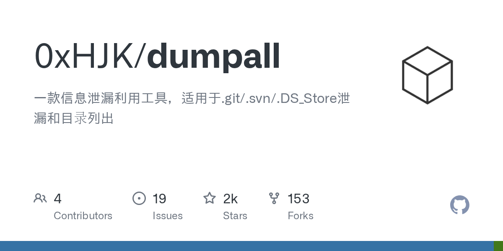

# Daily Digest · 2026-08-26

1. **[0xHJK/dumpall](https://github.com/0xHJK/dumpall)** ⭐ 1.6k · Python
   - 该工具专门用于利用暴露的版本控制存储库、配置文件和目录列表来恢复源代码和敏感信息。
   - [deepwiki](https://deepwiki.com/0xHJK/dumpall) · [zread](https://zread.ai/0xHJK/dumpall)

   

---
由 daily-digest bot 自动生成
