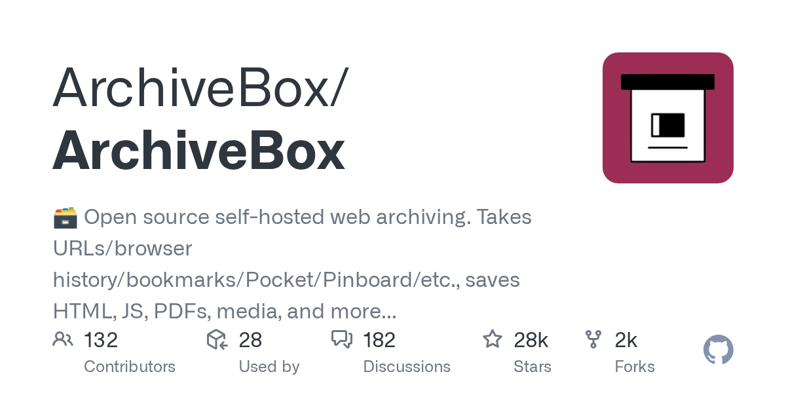

# Daily Digest · 2026-08-26

1. **[ArchiveBox/ArchiveBox](https://github.com/ArchiveBox/ArchiveBox)** ⭐ 28.2k · Python
   - ArchiveBox 是一个自托管的、开源的网页存档平台，能够以多种持久格式抓取并保存网页内容——包括 HTML、PDF、PNG 截图、WARC、媒体文件等。它的设计初衷是确保你的存档数据在未来数十年内依然可读，这些数据以普通文件和标准格式存储，无需 ArchiveBox 本身即可解码。该项目采用 MIT 许可证，基于 Python 3.13+ 和 Django 6 构建，当前版本为 0.9.29rc1，正稳步迈向稳定版。
   - [deepwiki](https://deepwiki.com/ArchiveBox/ArchiveBox) · [zread](https://zread.ai/ArchiveBox/ArchiveBox)

   

---
由 daily-digest bot 自动生成
