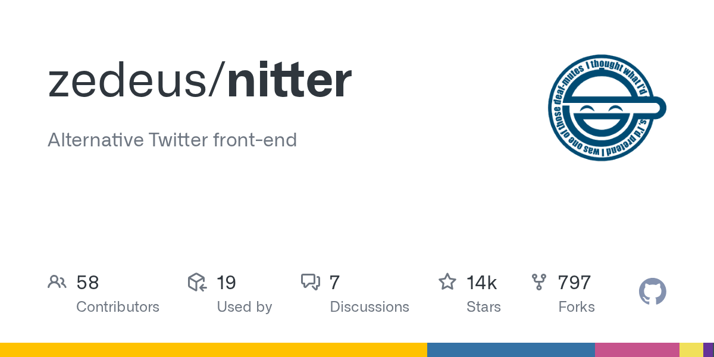

# Daily Digest · 2026-08-26

1. **[zedeus/nitter](https://github.com/zedeus/nitter)** ⭐ 13.5k · Nim
   - 解释其作为一个以隐私为中心的Twitter/X前端的目的,并概述其核心架构组成部分. 有关特定子系统的详细信息,请参阅本文中链接的儿童页面。
   - [deepwiki](https://deepwiki.com/zedeus/nitter) · [zread](https://zread.ai/zedeus/nitter)

   

---
由 daily-digest bot 自动生成
