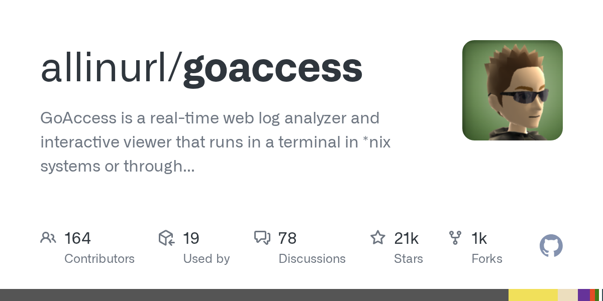

# Daily Digest · 2026-08-26

1. **[allinurl/goaccess](https://github.com/allinurl/goaccess)** ⭐ 20.9k · C
   - GoAccess 是一个开源的实时 Web 日志分析器和交互式浏览器,为系统管理员提供快速的 HTTP 统计数据,它可以在 Unix 类似系统的终端上运行,或通过浏览器提供视觉服务器报告。
   - [deepwiki](https://deepwiki.com/allinurl/goaccess) · [zread](https://zread.ai/allinurl/goaccess)

   

---
由 daily-digest bot 自动生成
