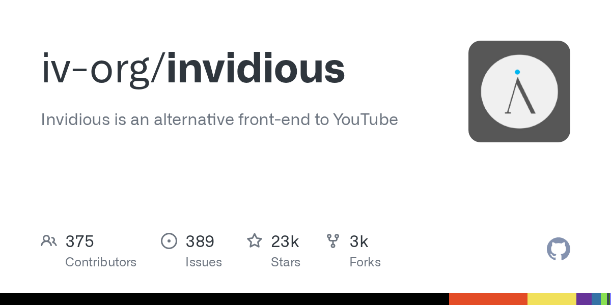

# Daily Digest · 2026-08-26

1. **[iv-org/invidious](https://github.com/iv-org/invidious)** ⭐ 22.8k · Crystal
   - Invidious 是一个开源的 YouTube 前端替代方案,专注于隐私,并提供清洁的用户体验. 本文档提供了 Invidious 代码库,其架构和构成系统的关键组件的技术概述。
   - [deepwiki](https://deepwiki.com/iv-org/invidious) · [zread](https://zread.ai/iv-org/invidious)

   

---
由 daily-digest bot 自动生成
