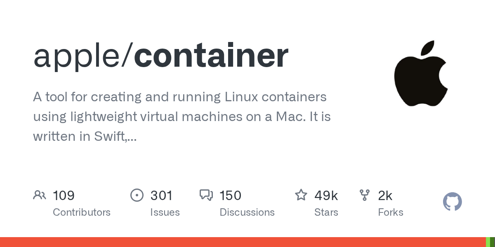

# Daily Digest · 2026-08-26

1. **[apple/container](https://github.com/apple/container)** ⭐ 49.4k · Swift
   - 此页面介绍了该项目:它是什么,它解决的问题,以及其主要组件的简要描述. 有关单个子系统的更深入的了解,请参阅系统架构和关键概念。
   - [deepwiki](https://deepwiki.com/apple/container) · [zread](https://zread.ai/apple/container)

   

---
由 daily-digest bot 自动生成
