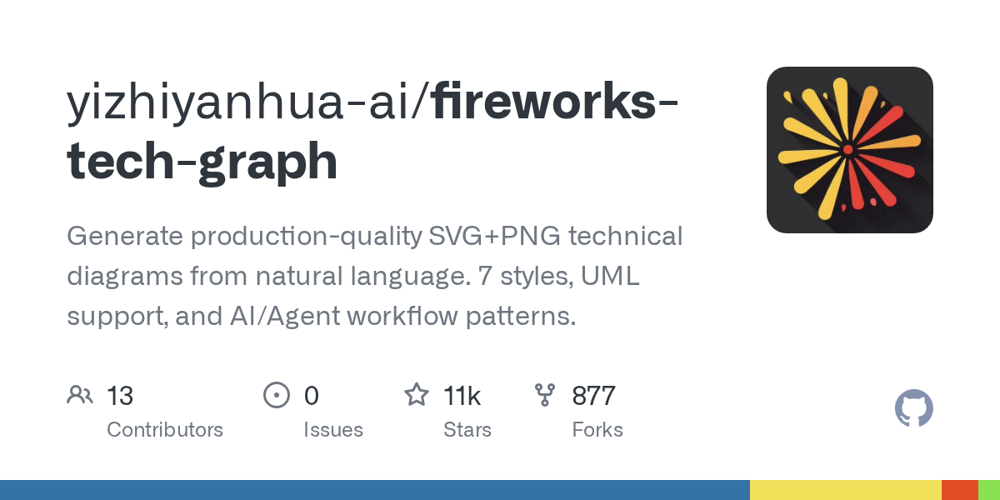

# Daily Digest · 2026-08-26

1. **[yizhiyanhua-ai/fireworks-tech-graph](https://github.com/yizhiyanhua-ai/fireworks-tech-graph)** ⭐ 10.9k · Python
   - 该项目是一个专门的引擎,旨在将英语和中文的自然语言描述转化为出版质量的技术图表 README.md:3-5. 它通过自动生成SVG和高分辨率PNG README.md:15-17来弥合概念系统描述和正式视觉资产之间的差距。
   - [deepwiki](https://deepwiki.com/yizhiyanhua-ai/fireworks-tech-graph) · [zread](https://zread.ai/yizhiyanhua-ai/fireworks-tech-graph)

   

---
由 daily-digest bot 自动生成
