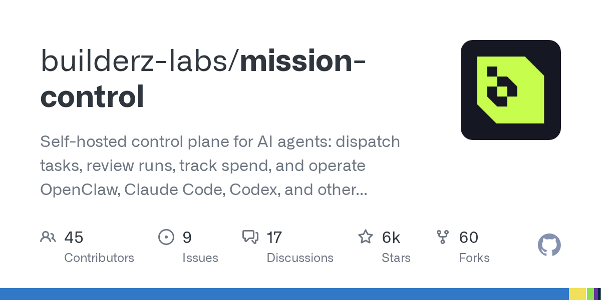

# Daily Digest · 2026-08-26

1. **[builderz-labs/mission-control](https://github.com/builderz-labs/mission-control)** ⭐ 6.1k · TypeScript
   - 本文介绍了 Mission Control,描述了其作为人工智能代理编排平台的目的,并提供了高层次的能力和架构的理解。 有关详细的安装和配置说明,请参阅 Getting Started。
   - [deepwiki](https://deepwiki.com/builderz-labs/mission-control) · [zread](https://zread.ai/builderz-labs/mission-control)

   

---
由 daily-digest bot 自动生成
