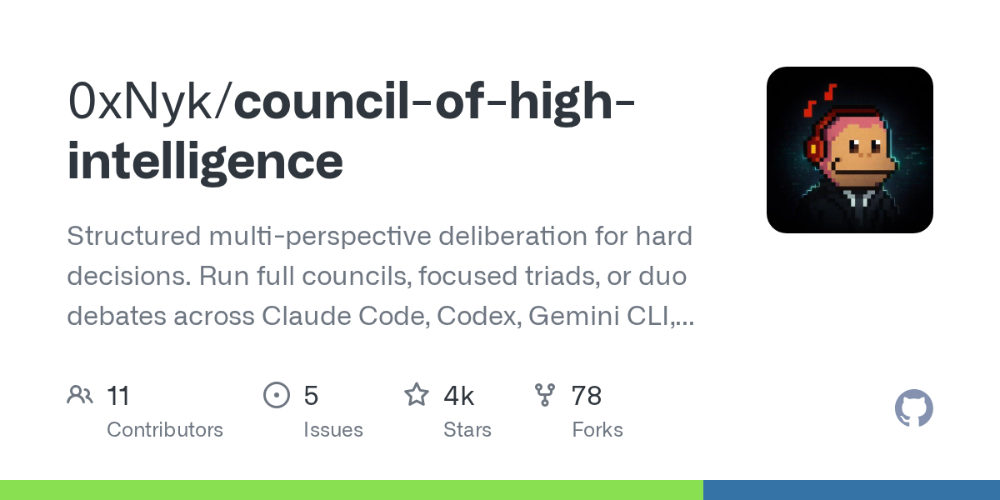

# Daily Digest · 2026-08-26

1. **[0xNyk/council-of-high-intelligence](https://github.com/0xNyk/council-of-high-intelligence)** ⭐ 4.2k · Shell
   - 高情报理事会是一个多代理组织框架,旨在解决复杂的决策问题,通过促进各种人工智能人员之间的结构性分歧 README:md:1-9.而不是依靠一个单一的法学硕士的“自信最好的猜测”,理事会召集一个由多达18个专门的代理人组成的董事会 - 从历史哲学家如苏格拉底到现代工程师。
   - [deepwiki](https://deepwiki.com/0xNyk/council-of-high-intelligence) · [zread](https://zread.ai/0xNyk/council-of-high-intelligence)

   

---
由 daily-digest bot 自动生成
