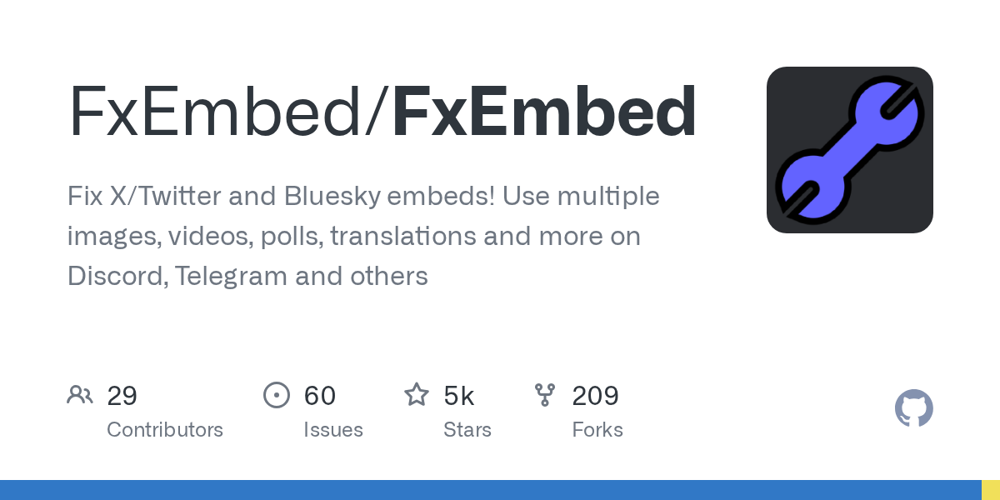

# Daily Digest · 2026-08-26

1. **[FxEmbed/FxEmbed](https://github.com/FxEmbed/FxEmbed)** ⭐ 4.9k · TypeScript
   - FxEmbed 是一个 Cloudflare Worker 应用程序,可增强 Discord、Telegram 和其他平台的社交媒体邮件嵌入功能,该系统作为一个单一的员工服务多个品牌域(fxtwitter.com、fixupx.com、 fxbsky.app、dxtiktok.com)并将标准的社交媒体链接转化为丰富的嵌入式视频、民意调查、翻译和媒体,这些链接在其他地方将不可用。
   - [deepwiki](https://deepwiki.com/FxEmbed/FxEmbed) · [zread](https://zread.ai/FxEmbed/FxEmbed)

   

---
由 daily-digest bot 自动生成
