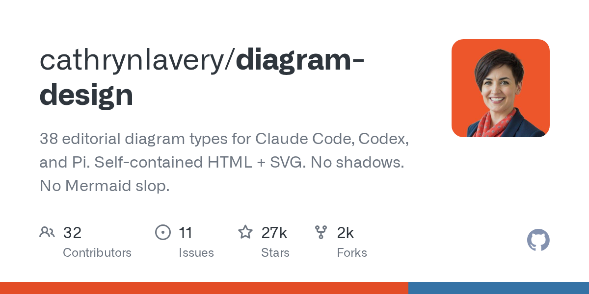

# Daily Digest · 2026-08-26

1. **[cathrynlavery/diagram-design](https://github.com/cathrynlavery/diagram-design)** ⭐ 27.0k · HTML
   - 从核心来看，Diagram Design 是一个固执己见的、面向编程式图表创建的设计系统。你只需描述需求；你的 AI Agent 便会选择合适的视觉类型，应用可换肤的出版级样式，并输出一个单一的  文件。该文件双击即可打开，支持离线查看，默认无需构建步骤且不包含 JavaScript。每张图表均提供三种静态变体——极简亮色、极简暗色和完整出版级风格——并涵盖 27 种视觉类型，横跨架构图、流程图、时序图、ER 模型、时间线、图表等。
   - [deepwiki](https://deepwiki.com/cathrynlavery/diagram-design) · [zread](https://zread.ai/cathrynlavery/diagram-design)

   

---
由 daily-digest bot 自动生成
