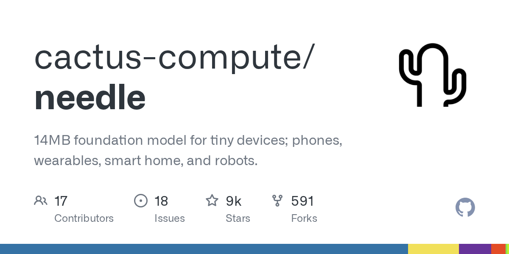

# Daily Digest · 2026-08-26

1. **[cactus-compute/needle](https://github.com/cactus-compute/needle)** ⭐ 9.2k · Python
   - Needle 2 是一个开放的 45M 参数模型,用于高性能,设备上工具调用,设备使用和结构化提取 README.md:3-5. 该系统基于简单注意网络 (SAN) 架构,优化为在大约 28 MB 的 RAM README.md:5-9 内运行为自有 14MB 二进制。
   - [deepwiki](https://deepwiki.com/cactus-compute/needle) · [zread](https://zread.ai/cactus-compute/needle)

   

---
由 daily-digest bot 自动生成
