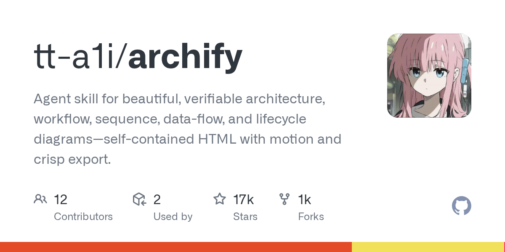

# Daily Digest · 2026-08-26

1. **[tt-a1i/archify](https://github.com/tt-a1i/archify)** ⭐ 16.6k · HTML
   - Archify是一个技术图表工具和代理技能,旨在将自然语言描述或代码库分析转化为专业,可主题和高分辨率的技术地图。它被优化用于使用LLM代理,如Claude Code,Cursor,Codex和OpenCode,提供从简单的英语意图到自有,交互式HTML文物的结构化管道。
   - [deepwiki](https://deepwiki.com/tt-a1i/archify) · [zread](https://zread.ai/tt-a1i/archify)

   

---
由 daily-digest bot 自动生成
