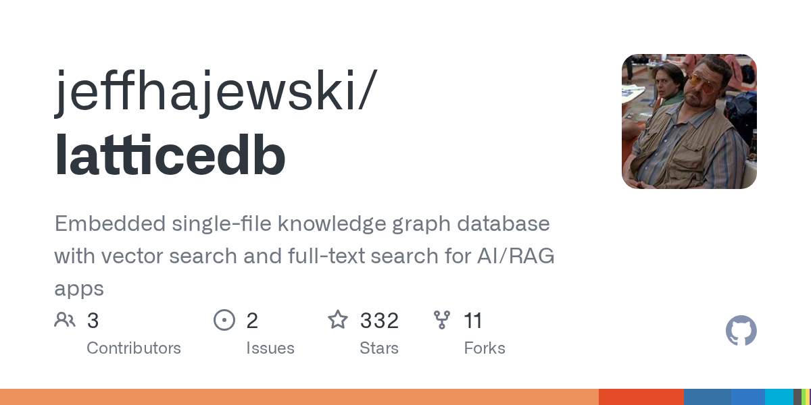

# Daily Digest · 2026-08-26

1. **[jeffhajewski/latticedb](https://github.com/jeffhajewski/latticedb)** ⭐ 332 · Zig
   - 嵌入式单文件知识图表数据库,可用于 AI/RAG 应用程序的矢量搜索和全文本搜索
   - [deepwiki](https://deepwiki.com/jeffhajewski/latticedb) · [zread](https://zread.ai/jeffhajewski/latticedb)

   

---
由 daily-digest bot 自动生成
