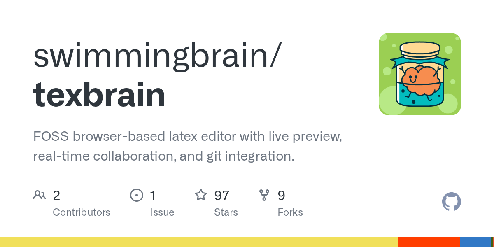

# Daily Digest · 2026-08-26

1. **[swimmingbrain/texbrain](https://github.com/swimmingbrain/texbrain)** ⭐ 122 · JavaScript
   - FOSS基于浏览器的文本编辑器,提供实时预览、实时协作和Git集成。
   - [deepwiki](https://deepwiki.com/swimmingbrain/texbrain) · [zread](https://zread.ai/swimmingbrain/texbrain)

   

---
由 daily-digest bot 自动生成
