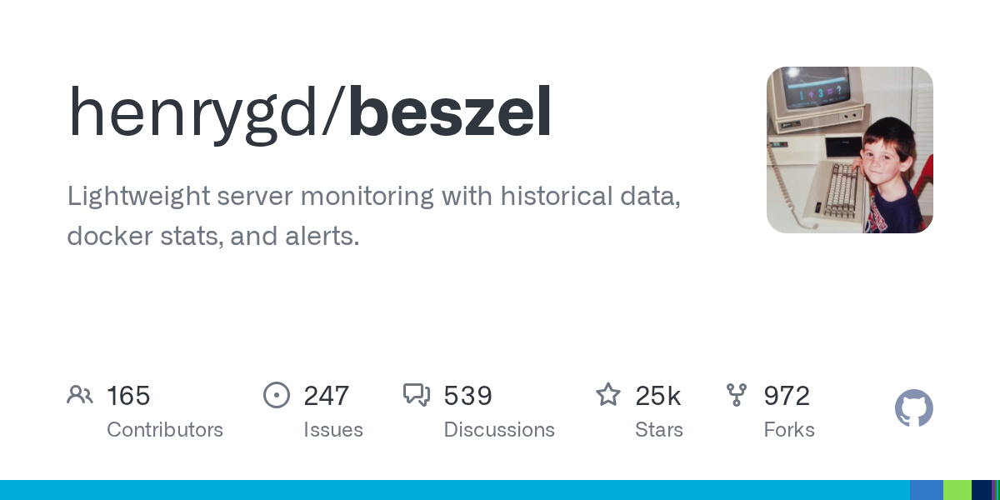

# Daily Digest · 2026-08-26

1. **[henrygd/beszel](https://github.com/henrygd/beszel)** ⭐ 24.7k · Go
   - 包括其用途、架构、核心组件和关键功能。有关特定子系统的详细信息,请参阅相关部分:设计细节的架构、指数收集的数据收集、时间序列管理的数据存储和聚合、前端的数据可视化、通知的警报系统和安装选项的部署。
   - [deepwiki](https://deepwiki.com/henrygd/beszel) · [zread](https://zread.ai/henrygd/beszel)

   

---
由 daily-digest bot 自动生成
