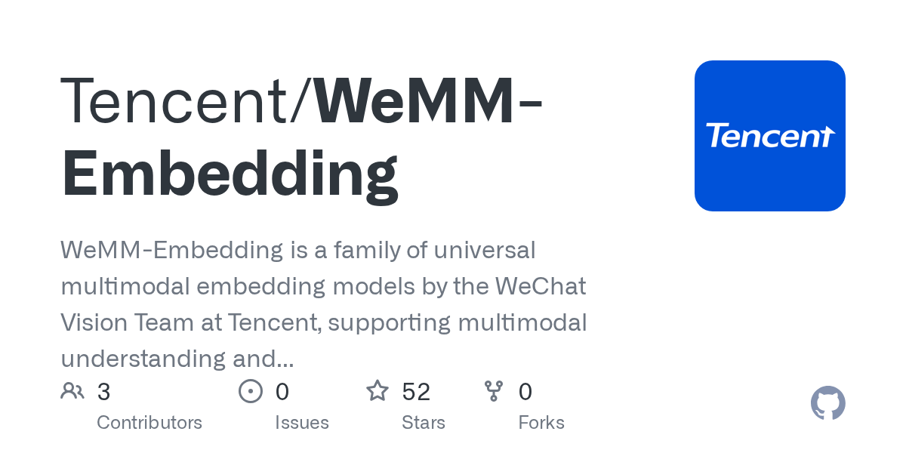

# Daily Digest · 2026-08-26

1. **[Tencent/WeMM-Embedding](https://github.com/Tencent/WeMM-Embedding)** ⭐ 78 · Python
   - WeMM-Embedding 是 Tencent WeChat Vision 团队的一系列通用多式嵌入模型,支持多式理解和检索。
   - [deepwiki](https://deepwiki.com/Tencent/WeMM-Embedding) · [zread](https://zread.ai/Tencent/WeMM-Embedding)

   

---
由 daily-digest bot 自动生成
