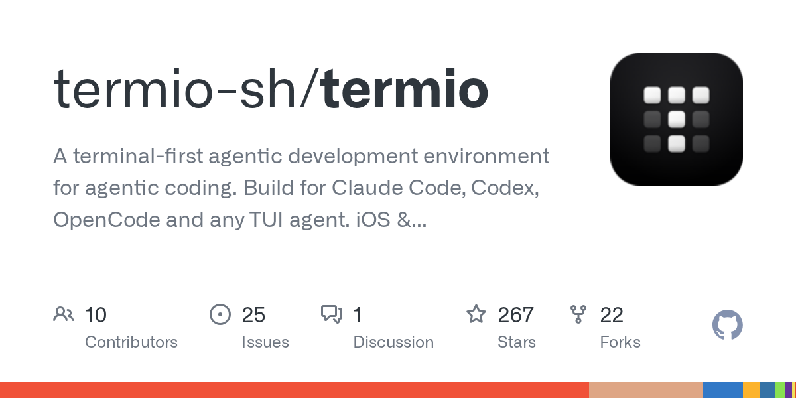

# Daily Digest · 2026-08-26

1. **[termio-sh/termio](https://github.com/termio-sh/termio)** ⭐ 267 · Swift
   - 用于代理编码的终端第一代理开发环境. 构建为 Claude Code、Codex、OpenCode 和任何 TUI 代理。
   - [deepwiki](https://deepwiki.com/termio-sh/termio) · [zread](https://zread.ai/termio-sh/termio)

   

---
由 daily-digest bot 自动生成
