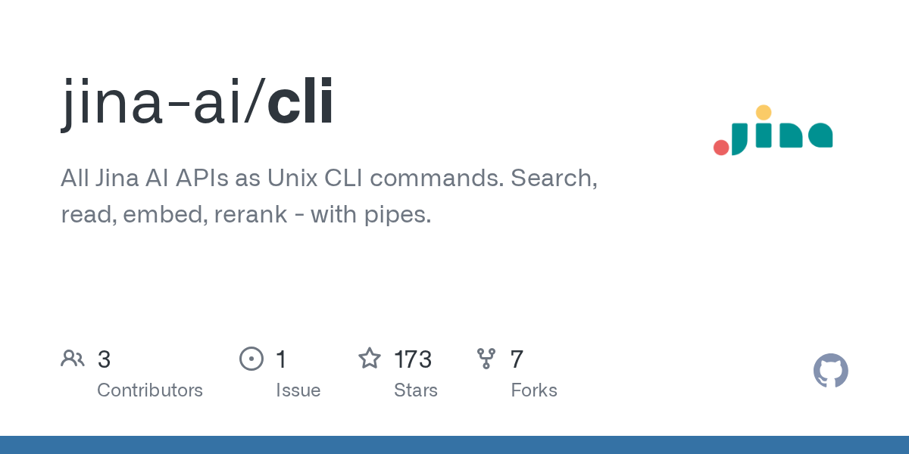

# Daily Digest · 2026-08-26

1. **[jina-ai/cli](https://github.com/jina-ai/cli)** ⭐ 173 · Python
   - 本文介绍了 jina-cli,它是 Jina AI API 的统一命令行界面,它解释了系统的目的、架构和设计理念. 有关安装和配置的说明,请参阅 Getting Started. 有关详细命令文档,请参阅命令参考。
   - [deepwiki](https://deepwiki.com/jina-ai/cli) · [zread](https://zread.ai/jina-ai/cli)

   

---
由 daily-digest bot 自动生成
