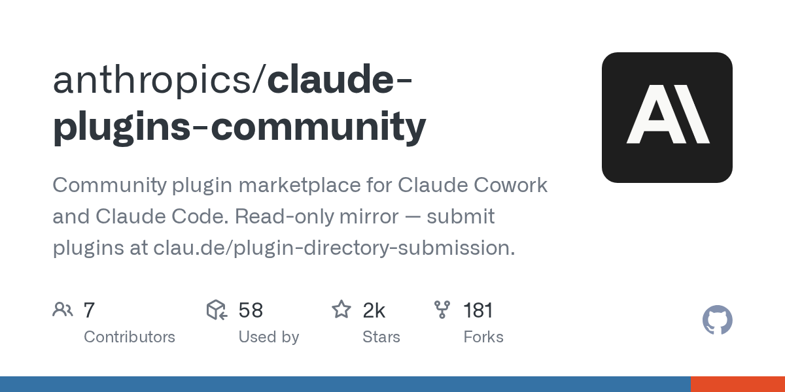

# Daily Digest · 2026-08-26

1. **[anthropics/claude-plugins-community](https://github.com/anthropics/claude-plugins-community)** ⭐ 2.0k · Python
   - 该存储库是克劳德生态系统的社区插件市场的官方,仅供阅读的镜子,它提供了一个集中式注册表,可以为克劳德·科沃克和克劳德代码CLI README.md:1-22提供插件的发现和安装。
   - [deepwiki](https://deepwiki.com/anthropics/claude-plugins-community) · [zread](https://zread.ai/anthropics/claude-plugins-community)

   

---
由 daily-digest bot 自动生成
