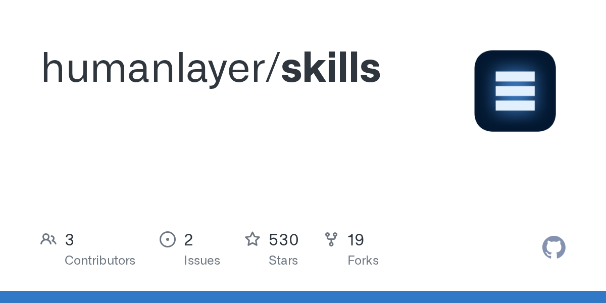

# Daily Digest · 2026-08-26

1. **[humanlayer/skills](https://github.com/humanlayer/skills)** ⭐ 530 · TypeScript
   - 该库是一组专门的 Claude Code 插件,旨在提高开发人员的生产力,提高 AI 指令遵守性,并通过代理控制循环自动化复杂的编码工作流程。
   - [deepwiki](https://deepwiki.com/humanlayer/skills) · [zread](https://zread.ai/humanlayer/skills)

   

---
由 daily-digest bot 自动生成
