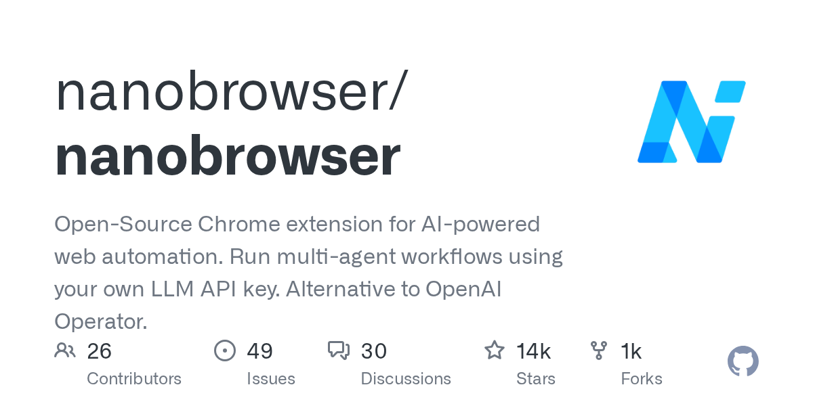

# Daily Digest · 2026-08-26

1. **[nanobrowser/nanobrowser](https://github.com/nanobrowser/nanobrowser)** ⭐ 13.7k · TypeScript
   - 本指南为首次安装、配置和使用 Nanobrowser 提供了逐步的说明,它涵盖了必要的基本设置步骤,以便在您的浏览器中使用正确配置的 LLM 提供商和代理模型运行 AI 网络自动化扩展。
   - [deepwiki](https://deepwiki.com/nanobrowser/nanobrowser) · [zread](https://zread.ai/nanobrowser/nanobrowser)

   

---
由 daily-digest bot 自动生成
