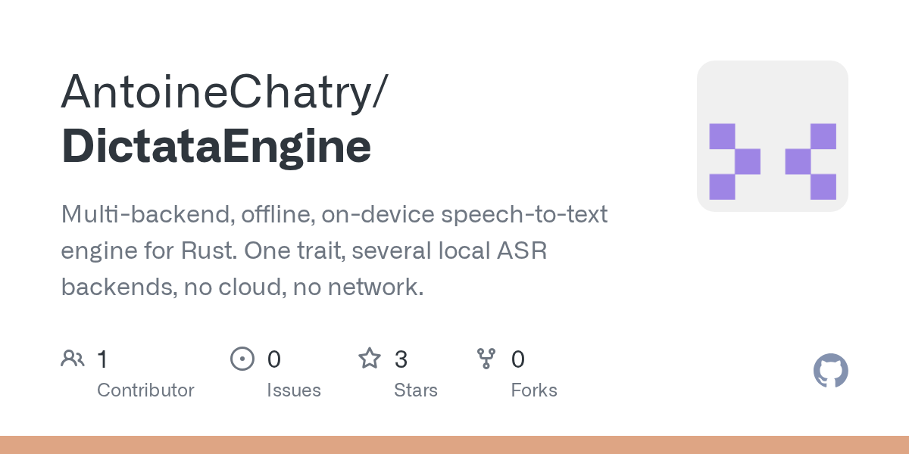

# Daily Digest · 2026-08-26

1. **[AntoineChatry/DictataEngine](https://github.com/AntoineChatry/DictataEngine)** ⭐ 3 · Rust
   - Multi-backend,离线,设备语音文本引擎为Rust. 一个特征,几个本地ASR后端,没有云,没有网络。
   - [deepwiki](https://deepwiki.com/AntoineChatry/DictataEngine) · [zread](https://zread.ai/AntoineChatry/DictataEngine)

   

---
由 daily-digest bot 自动生成
