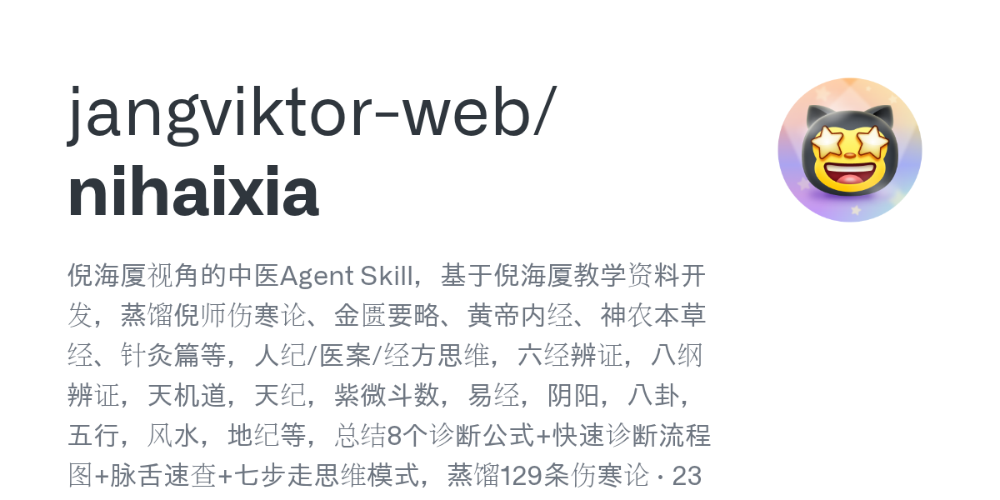

# Daily Digest · 2026-08-26

1. **[jangviktor-web/nihaixia](https://github.com/jangviktor-web/nihaixia)** ⭐ 2.6k · HTML
   - 倪海厦视角的中医Agent Skill，基于倪海厦教学资料开发，蒸馏倪师伤寒论、金匮要略、黄帝内经、神农本草经、针灸篇等，人纪/医案/经方思维，六经辨证，八纲辨证，天机道，天纪，紫微斗数，易经，阴阳，八卦，五行，风水，地纪等，总结8个诊断公式+快速诊断流程图+脉舌速查+七步走思维模式，蒸馏129条伤寒论 · 23篇金匮 · 72篇黄帝内经 · 神农本草经374种本草（上137/中110/下127） · 1257 例结构化案例 + 243 例叙事医案 · 2,452页讲义。
   - [deepwiki](https://deepwiki.com/jangviktor-web/nihaixia) · [zread](https://zread.ai/jangviktor-web/nihaixia)

   

---
由 daily-digest bot 自动生成
