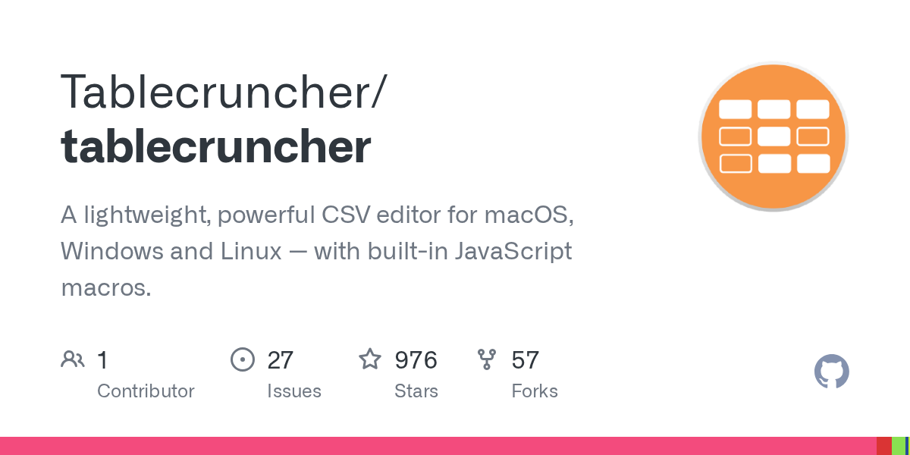

# Daily Digest · 2026-08-26

1. **[Tablecruncher/tablecruncher](https://github.com/Tablecruncher/tablecruncher)** ⭐ 976 · C++
   - 一个跨平台的CSV编辑器,用于处理大型数据集,涵盖应用程序的目的、关键功能、架构模式和技术堆栈。
   - [deepwiki](https://deepwiki.com/Tablecruncher/tablecruncher) · [zread](https://zread.ai/Tablecruncher/tablecruncher)

   

---
由 daily-digest bot 自动生成
