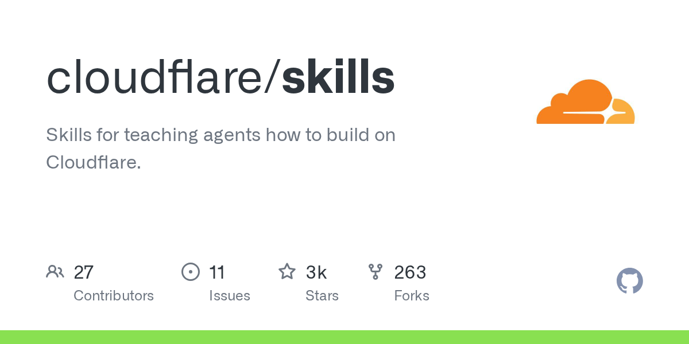

# Daily Digest · 2026-08-27

1. **[cloudflare/skills](https://github.com/cloudflare/skills)** ⭐ 2.7k · Shell
   - Cloudflare Skills存储库是一个Agent Skills的集合，旨在帮助AI编码助理（如Claude Code，OpenCode，OpenAI Codex和Pi）在Cloudflare开发人员平台上构建应用程序README.md：1-7。此存储库提供上下文文档，代码生成命令以及与Cloudflare的模型上下文协议（MCP）服务器的集成，以实现高效的编程。
   - [deepwiki](https://deepwiki.com/cloudflare/skills) · [zread](https://zread.ai/cloudflare/skills)

   

---
由 daily-digest bot 自动生成
