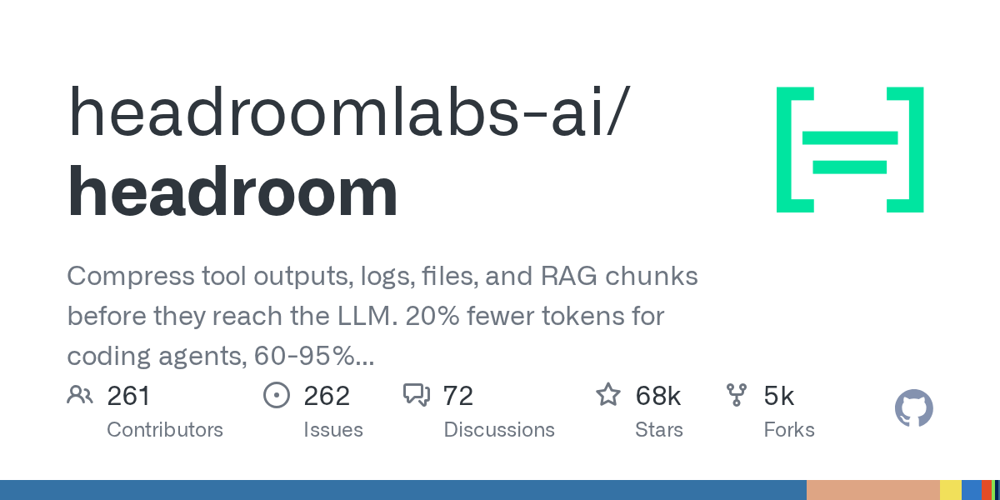

# Daily Digest · 2026-08-27

1. **[headroomlabs-ai/headroom](https://github.com/headroomlabs-ai/headroom)** ⭐ 67.7k · Python
   - Headroom 是一个高性能的环境优化层,旨在在在 AI 代理 / 应用程序和 LLM 提供商之间坐下来,其主要目的是减少代币消耗 - 因此操作成本和延迟 - 50 - 90% 而不牺牲模型响应的准确性 pyproject.toml:6-8.
   - [deepwiki](https://deepwiki.com/headroomlabs-ai/headroom) · [zread](https://zread.ai/headroomlabs-ai/headroom)

   

---
由 daily-digest bot 自动生成
