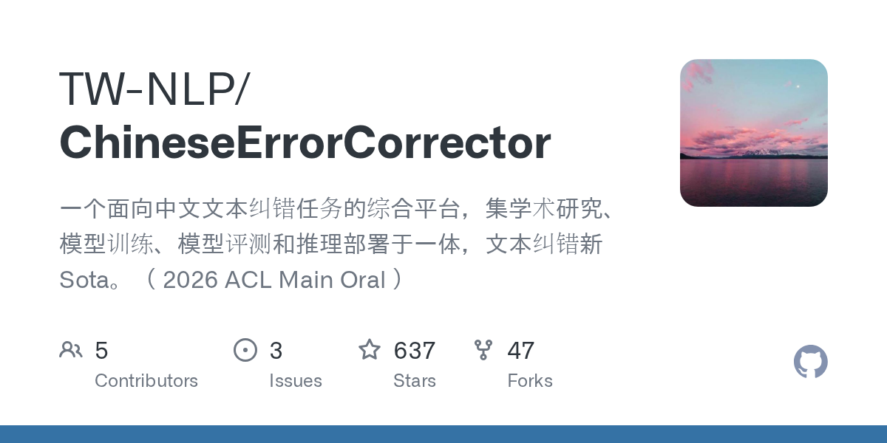

# 2026-08-28

1. **[TW-NLP/ChineseErrorCorrector](https://github.com/TW-NLP/ChineseErrorCorrector)** ⭐ 637 · Python
   - 基于LLM的中文拼写和语法纠正框架. 该系统支持多个推断后端,提供各种尺寸的预训练模型,并包括开发定制的中文错误纠正模型的完整培训管道。
   - [deepwiki](https://deepwiki.com/TW-NLP/ChineseErrorCorrector) · [zread](https://zread.ai/TW-NLP/ChineseErrorCorrector)

   

---
由 daily-digest bot 自动生成
