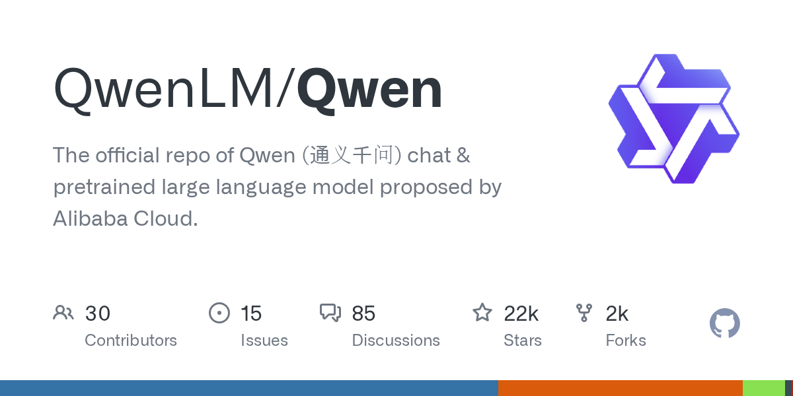

# 2026-08-28

1. **[QwenLM/Qwen](https://github.com/QwenLM/Qwen)** ⭐ 21.7k · Python
   - 本页面提供了Qwen存储库的技术概述,其中包含与Qwen(发音“Chwen”)系列大型语言模型工作的代码。
   - [deepwiki](https://deepwiki.com/QwenLM/Qwen) · [zread](https://zread.ai/QwenLM/Qwen)

   

---
由 daily-digest bot 自动生成
