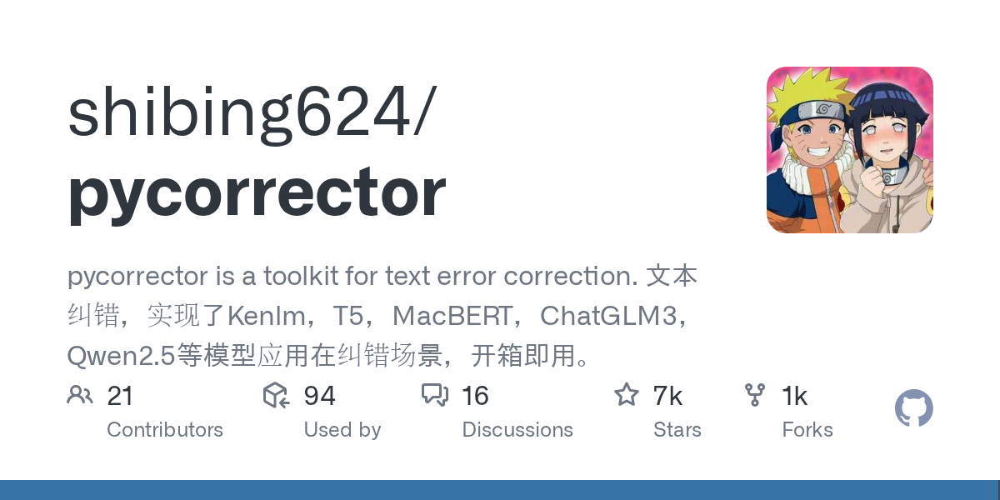

# 2026-08-28

1. **[shibing624/pycorrector](https://github.com/shibing624/pycorrector)** ⭐ 6.5k · Python
   - Pycorrector 是一套全面的 Python 工具包,用于自动检测和纠正中文文本中的错误,提供一系列的纠正方法,从传统的统计方法到先进的神经模型,支持各种错误类型,包括字符替代,词级错误和正确的称号错误。
   - [deepwiki](https://deepwiki.com/shibing624/pycorrector) · [zread](https://zread.ai/shibing624/pycorrector)

   

---
由 daily-digest bot 自动生成
