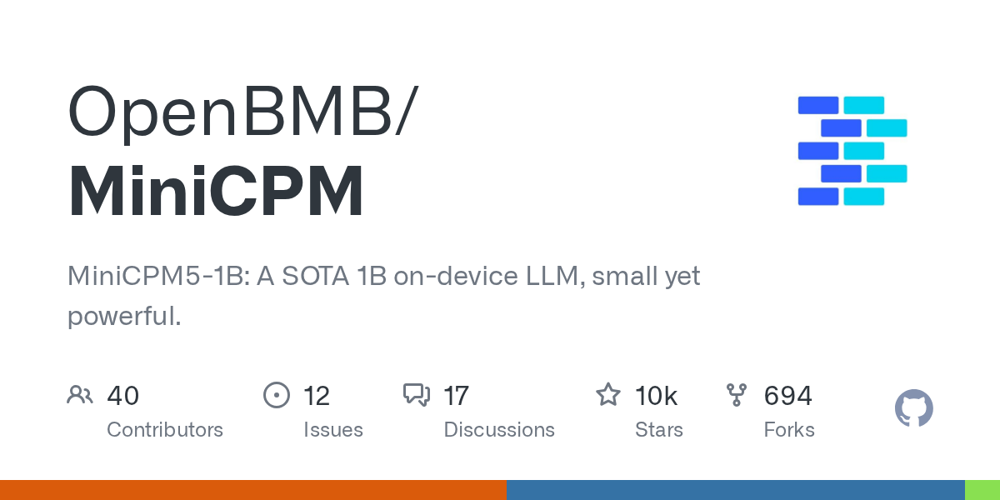

# 2026-08-28

1. **[OpenBMB/MiniCPM](https://github.com/OpenBMB/MiniCPM)** ⭐ 10.3k · Jupyter Notebook
   - 包括架构、功能、性能基准和专业变体,涵盖了技术进步、关键创新和所有世代的模型规格。
   - [deepwiki](https://deepwiki.com/OpenBMB/MiniCPM) · [zread](https://zread.ai/OpenBMB/MiniCPM)

   

---
由 daily-digest bot 自动生成
