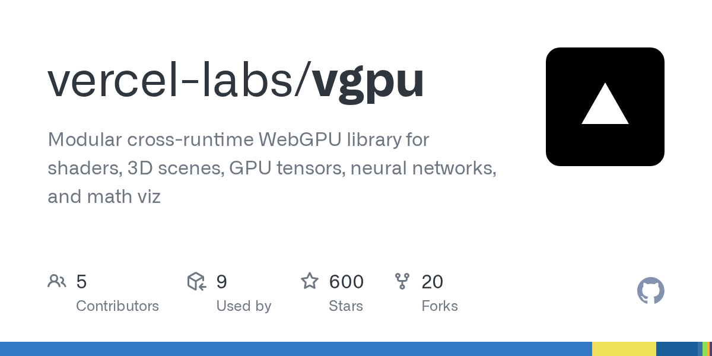

# 2026-08-28

1. **[vercel-labs/vgpu](https://github.com/vercel-labs/vgpu)** ⭐ 600 · TypeScript
   - 模块化跨运行时 WebGPU 库用于影像、3D 场景、GPU 压缩器、神经网络和数学视觉
   - [deepwiki](https://deepwiki.com/vercel-labs/vgpu) · [zread](https://zread.ai/vercel-labs/vgpu)

   

---
由 daily-digest bot 自动生成
