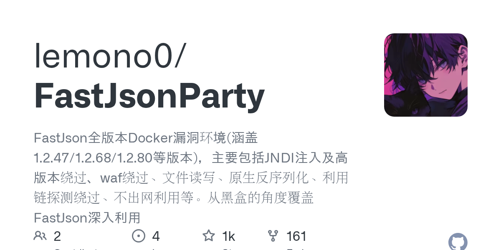

# 2026-08-28

1. **[lemono0/FastJsonParty](https://github.com/lemono0/FastJsonParty)** ⭐ 1.2k · Python
   - FastJsonParty 是一个全面的 Docker 环境集合,旨在展示和促进在多个版本中测试各种 FastJson 漏洞,该库为安全研究人员,渗透测试人员和开发人员提供一个教育平台,以了解,探索和实践在受控环境中利用 FastJson 漏洞。
   - [deepwiki](https://deepwiki.com/lemono0/FastJsonParty) · [zread](https://zread.ai/lemono0/FastJsonParty)

   

---
由 daily-digest bot 自动生成
