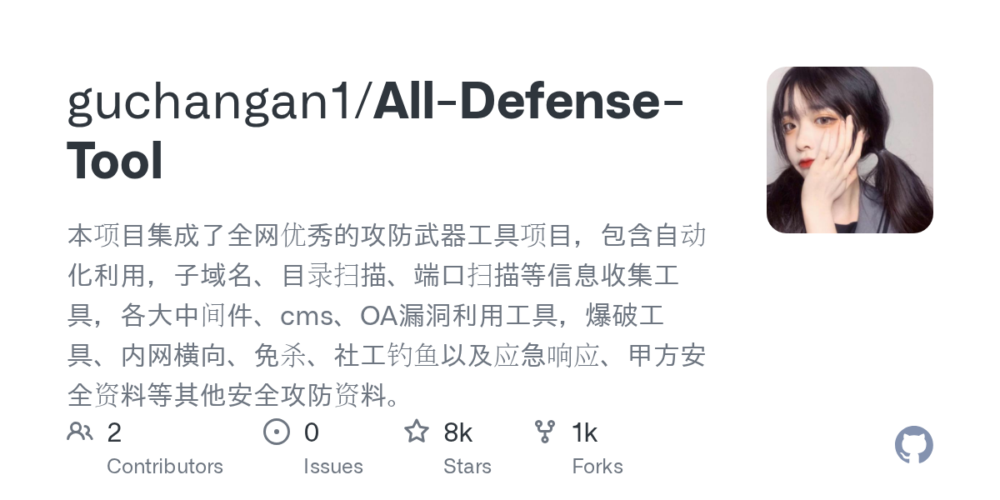

# 2026-08-28

1. **[guchangan1/All-Defense-Tool](https://github.com/guchangan1/All-Defense-Tool)** ⭐ 8.0k · Python
   - All-Defense-Tool 是开源攻击和防御网络安全工具的综合集合,为安全专业人员、渗透测试人员、红色团队操作员、蓝色团队防御人员和安全爱好者提供集中的资源,涵盖了从侦察到剥削到防御和事件响应的整个安全生命周期。
   - [deepwiki](https://deepwiki.com/guchangan1/All-Defense-Tool) · [zread](https://zread.ai/guchangan1/All-Defense-Tool)

   

---
由 daily-digest bot 自动生成
