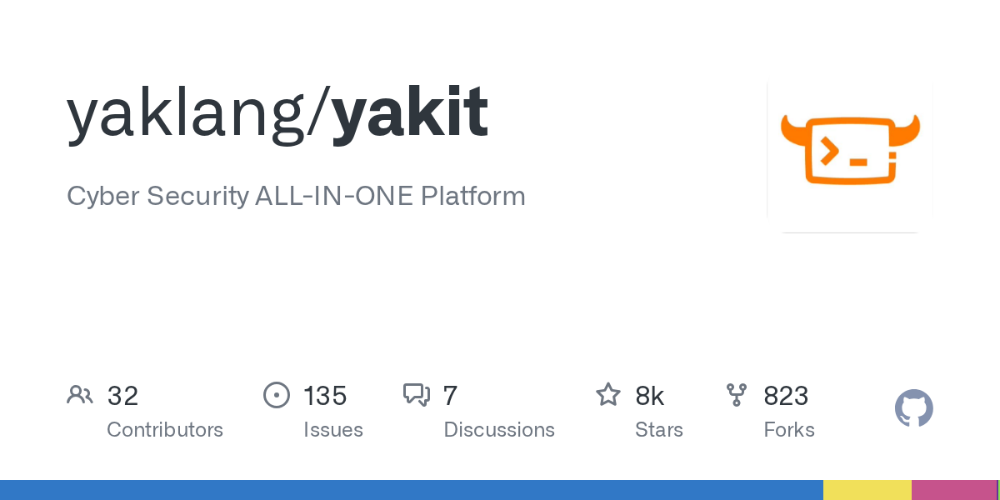

# 2026-08-28

1. **[yaklang/yakit](https://github.com/yaklang/yakit)** ⭐ 7.7k · TypeScript
   - Yakit是基于Electron构建的全面的安全测试和漏洞评估平台,为Yaklang安全测试引擎提供图形用户界面,该文件介绍了Yakit的核心架构、关键组件和主要功能。
   - [deepwiki](https://deepwiki.com/yaklang/yakit) · [zread](https://zread.ai/yaklang/yakit)

   

---
由 daily-digest bot 自动生成
