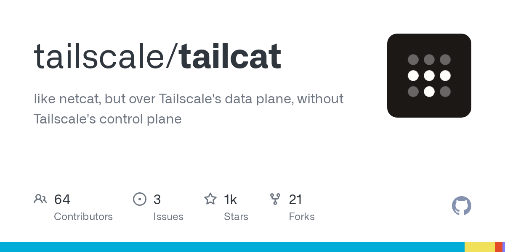

# Daily Digest · 2026-08-28

1. **[tailscale/tailcat](https://github.com/tailscale/tailcat)** ⭐ 1.6k · Go
   - Tailcat 是 Tailscale 数据平面的专门实现,旨在提供两个机器之间的点到点 WireGuard® 加密隧道,而不需要集中控制平面 README.md:7-16. 它利用 Tailscale 的开源组件,特别用于 NAT 穿越和 DERP 传输,以建立安全连接,使用带外元数据传输。
   - [deepwiki](https://deepwiki.com/tailscale/tailcat) · [zread](https://zread.ai/tailscale/tailcat)

   

---
由 daily-digest bot 自动生成
